# 📖 Agno Playground - Documentação Técnica para Confluence

## 🎯 Visão Geral

O **Agno Playground** é uma plataforma profissional para desenvolvimento e experimentação com agentes de IA inteligentes. Construído sobre o framework Agno e Google Gemini, oferece uma arquitetura extensível com orquestração automática de ferramentas especializadas.

---

## 🏗️ Arquitetura do Sistema

### Diagrama de Arquitetura Geral

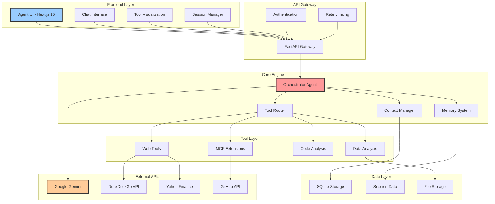

### Fluxo de Dados Principal

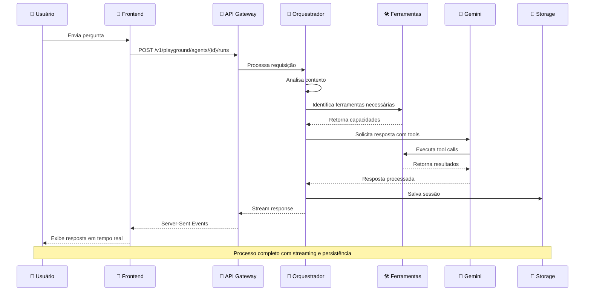

---

## 🧠 Sistema de Orquestração

### Arquitetura do Orquestrador

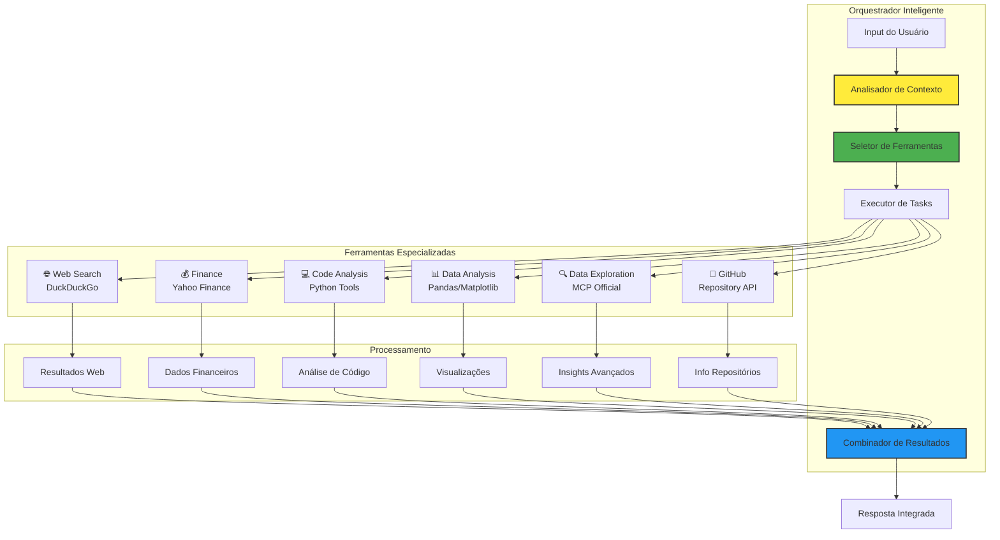

### Lógica de Seleção de Ferramentas

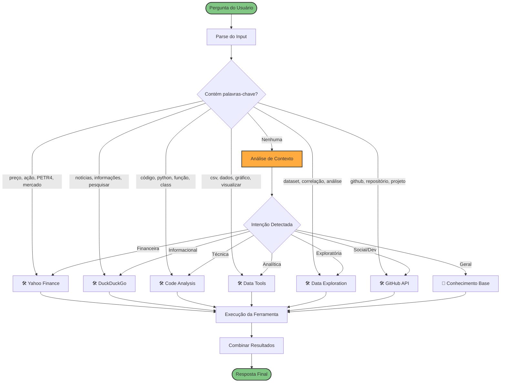

---

## 🛠️ Ferramentas e Capacidades

### Mapa de Ferramentas Disponíveis

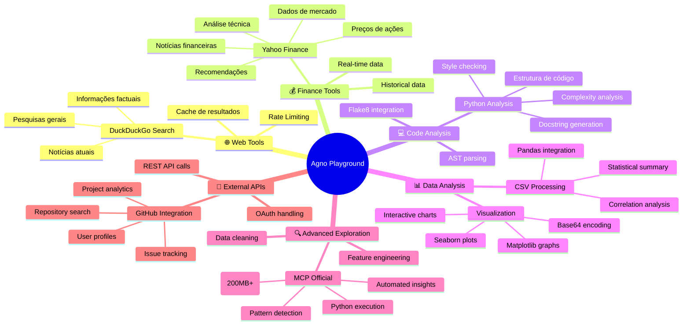

### Matriz de Capacidades

| Ferramenta | Entrada | Saída | Casos de Uso |
|------------|---------|-------|--------------|
| **DuckDuckGo** | Query text | Web results + URLs | Pesquisas, notícias, informações gerais |
| **Yahoo Finance** | Símbolo da ação | Preços, dados históricos | Análise financeira, investimentos |
| **Code Analysis** | Arquivo Python | Métricas, sugestões | Code review, documentação |
| **Data Tools** | CSV, arrays | Gráficos, estatísticas | Análise exploratória rápida |
| **Data Exploration** | Dataset grande | Insights automáticos | Análise profunda de dados |
| **GitHub API** | Repository name | Metadados, issues | Pesquisa de projetos open source |

---

## 📊 Fluxo de Processamento de Dados

### Pipeline de Análise de Dados

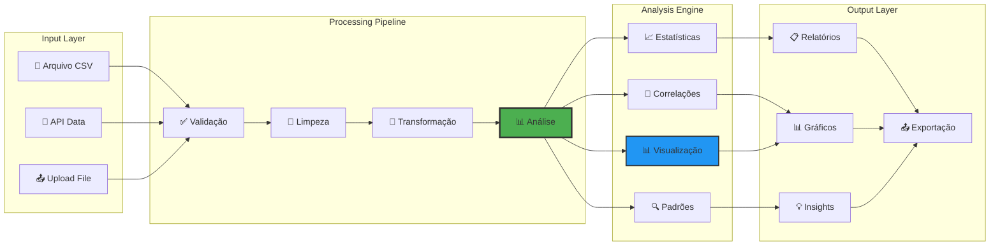

### Tipos de Visualização Suportados

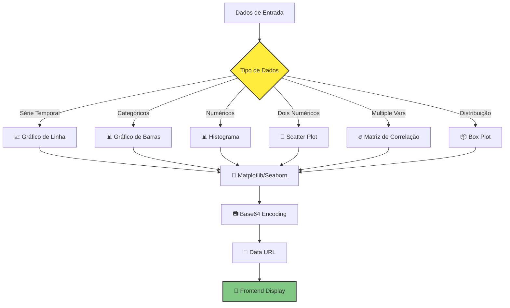

---

## 🔗 Integração MCP (Model Context Protocol)

### Arquitetura MCP

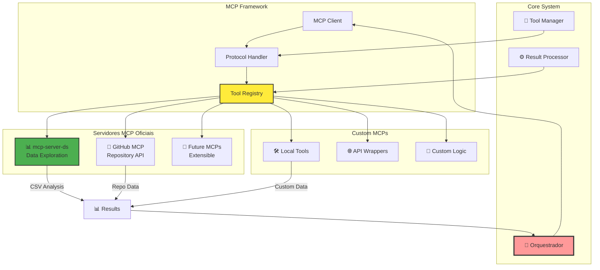

### Fluxo de Execução MCP

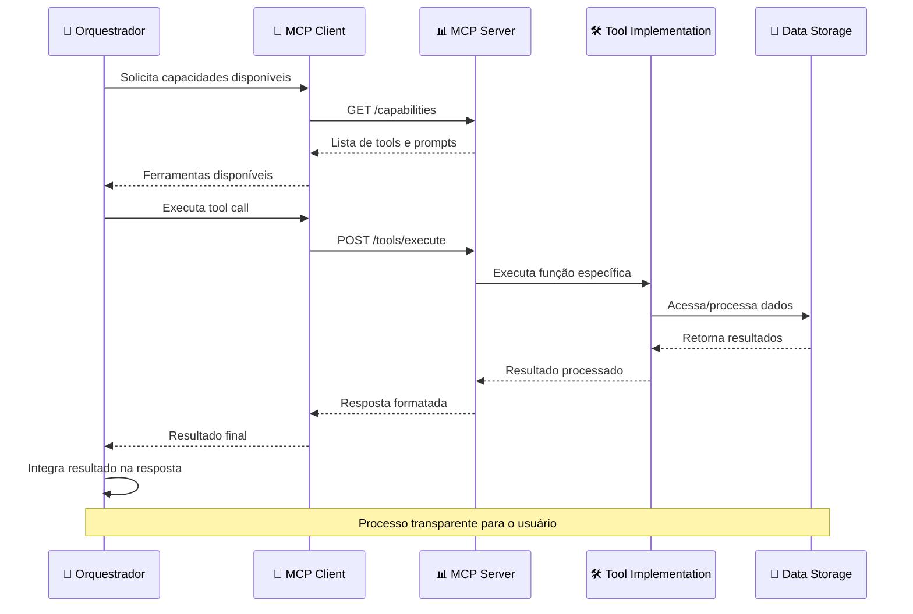

---

## 🎨 Interface do Usuário

### Componentes da Interface

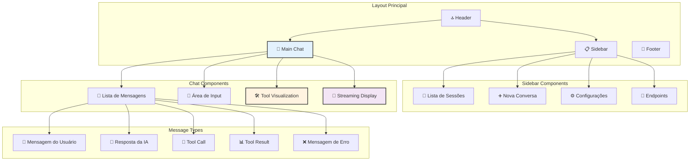

### Fluxo de Interação do Usuário

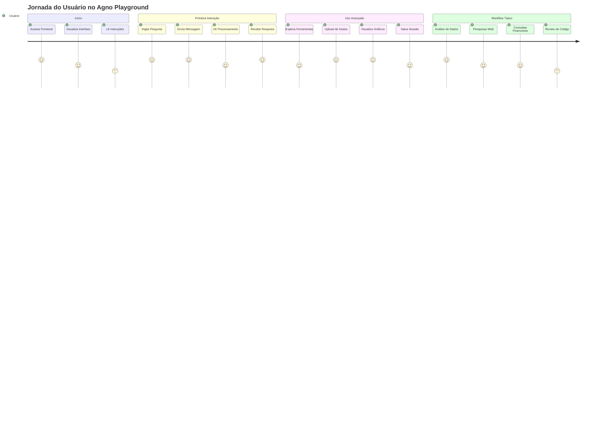

---

## ⚙️ Configuração e Deployment

### Arquitetura de Deployment

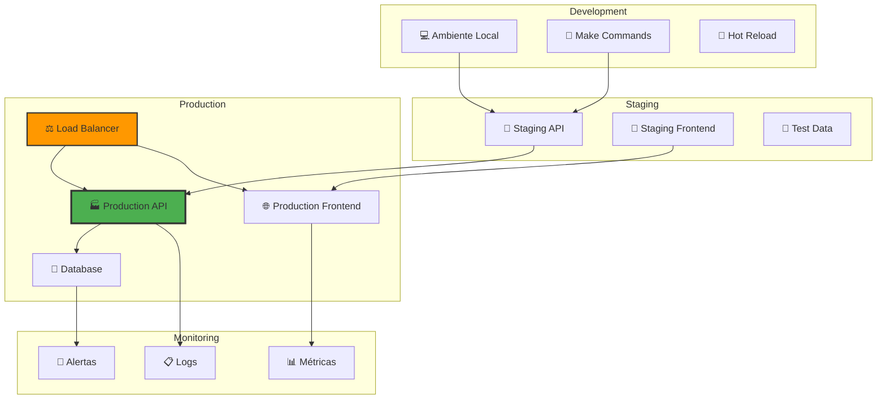

### Configuração de Ambiente

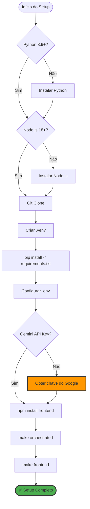

---

## 🧪 Testes e Qualidade

### Estratégia de Testes

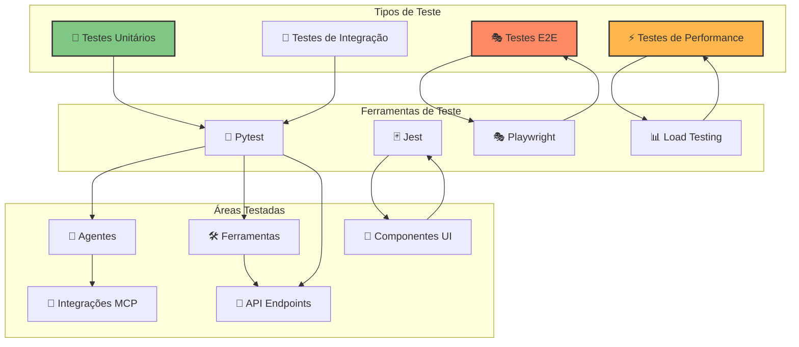

### Pipeline de CI/CD

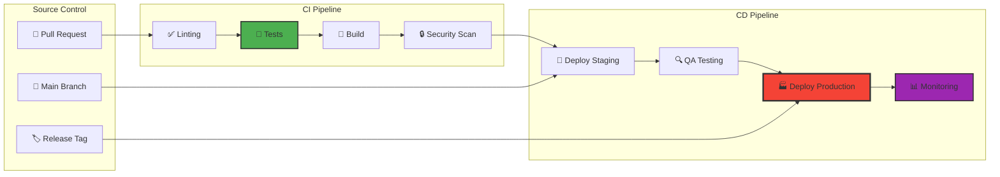

---

## 🔄 Pipeline CI/CD

### Fluxo de Integração Contínua

```mermaid
graph LR
    subgraph "Desenvolvimento"
        Dev[👨‍💻 Desenvolvedor]
        LocalTest[🧪 Testes Locais]
        Commit[📝 Commit]
    end
    
    subgraph "CI Pipeline"
        GitHub[📚 GitHub]
        Actions[⚡ GitHub Actions]
        Tests[🧪 Testes Automatizados]
        Build[🔨 Build]
        SecurityScan[🔒 Security Scan]
    end
    
    subgraph "Quality Gates"
        CodeQuality[📊 Qualidade do Código]
        Coverage[📈 Coverage]
        Linting[✨ Linting]
        TypeCheck[🔍 Type Check]
    end
    
    subgraph "Deployment"
        Staging[🚀 Staging]
        ProdDeploy[🏭 Production]
        Monitoring[👀 Monitoring]
    end
    
    Dev --> LocalTest
    LocalTest --> Commit
    Commit --> GitHub
    GitHub --> Actions
    Actions --> Tests
    Tests --> Build
    Build --> SecurityScan
    SecurityScan --> CodeQuality
    CodeQuality --> Coverage
    Coverage --> Linting
    Linting --> TypeCheck
    TypeCheck --> Staging
    Staging --> ProdDeploy
    ProdDeploy --> Monitoring
    
    style GitHub fill:#f9f,stroke:#333,stroke-width:2px
    style Actions fill:#bbf,stroke:#333,stroke-width:2px
    style ProdDeploy fill:#9f9,stroke:#333,stroke-width:2px
```

### Workflow de Desenvolvimento

```mermaid
gitgraph
    commit id: "Initial Setup"
    branch feature
    checkout feature
    commit id: "Add MCP Support"
    commit id: "Implement Data Tools"
    commit id: "Frontend Integration"
    checkout main
    merge feature
    commit id: "Release v1.0"
    branch hotfix
    checkout hotfix
    commit id: "Fix Critical Bug"
    checkout main
    merge hotfix
    commit id: "Release v1.0.1"
    branch enhancement
    checkout enhancement
    commit id: "UI Improvements"
    commit id: "Performance Opt"
    checkout main
    merge enhancement
    commit id: "Release v1.1"
```

---

## 🎯 Roadmap e Próximos Passos

### Mapa de Evolução

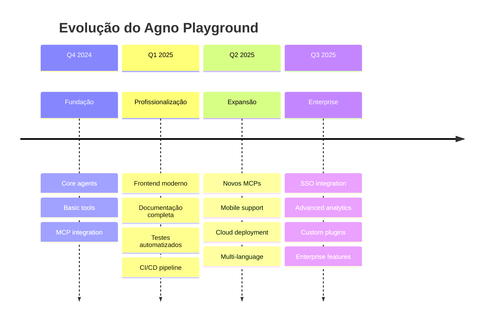

### Arquitetura Futura

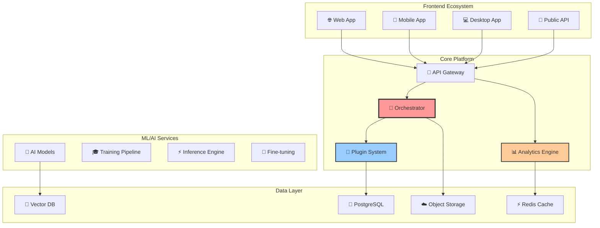

---

## 📈 Métricas e Monitoramento

### Dashboard de Métricas

```mermaid
graph TB
    subgraph "User Metrics"
        ActiveUsers[👤 Usuários Ativos]
        Sessions[💬 Sessões]
        RetentionRate[📈 Taxa de Retenção]
        EngagementScore[🎯 Score de Engajamento]
    end
    
    subgraph "System Metrics"
        ResponseTime[⚡ Tempo de Resposta]
        ThroughputRPS[📊 Throughput (RPS)]
        ErrorRate[❌ Taxa de Erro]
        Availability[✅ Disponibilidade]
    end
    
    subgraph "AI Metrics"
        ModelLatency[🤖 Latência do Modelo]
        TokenUsage[🎫 Uso de Tokens]
        ToolAccuracy[🎯 Precisão das Ferramentas]
        UserSatisfaction[😊 Satisfação do Usuário]
    end
    
    subgraph "Business Metrics"
        ConversionRate[💰 Taxa de Conversão]
        FeatureAdoption[📱 Adoção de Features]
        SupportTickets[🎫 Tickets de Suporte]
        Revenue[💵 Receita]
    end
    
    ActiveUsers --> SessionAnalysis[📊 Análise de Sessões]
    ResponseTime --> PerformanceOpt[⚡ Otimização]
    ModelLatency --> ResourceScaling[📈 Escalonamento]
    ConversionRate --> BusinessInsights[📊 Insights de Negócio]
    
    style SessionAnalysis fill:#e1f5fe,stroke:#333,stroke-width:2px
    style PerformanceOpt fill:#fff3e0,stroke:#333,stroke-width:2px
    style ResourceScaling fill:#f3e5f5,stroke:#333,stroke-width:2px
    style BusinessInsights fill:#e8f5e8,stroke:#333,stroke-width:2px
```

---

## 🔐 Segurança e Conformidade

### Modelo de Segurança

```mermaid
graph TB
    subgraph "Authentication"
        Login[🔑 Login]
        JWT[🎫 JWT Tokens]
        OAuth[🔐 OAuth 2.0]
        MFA[📱 2FA/MFA]
    end
    
    subgraph "Authorization"
        RBAC[👥 Role-Based Access]
        Permissions[✅ Permissions]
        APIKeys[🔑 API Keys]
        RateLimit[⏱️ Rate Limiting]
    end
    
    subgraph "Data Protection"
        Encryption[🔒 Encryption at Rest]
        TLS[🔐 TLS in Transit]
        Anonymization[👤 Data Anonymization]
        Retention[🗂️ Data Retention]
    end
    
    subgraph "Monitoring"
        AuditLogs[📋 Audit Logs]
        ThreatDetection[🚨 Threat Detection]
        Compliance[📜 Compliance Check]
        Incident[🚨 Incident Response]
    end
    
    Login --> JWT
    JWT --> RBAC
    OAuth --> Permissions
    MFA --> APIKeys
    
    RBAC --> Encryption
    Permissions --> TLS
    APIKeys --> Anonymization
    RateLimit --> Retention
    
    Encryption --> AuditLogs
    TLS --> ThreatDetection
    Anonymization --> Compliance
    Retention --> Incident
    
    style Login fill:#ffcdd2,stroke:#333,stroke-width:2px
    style Encryption fill:#c8e6c9,stroke:#333,stroke-width:2px
    style AuditLogs fill:#fff3e0,stroke:#333,stroke-width:2px
```

---

## 📝 Conclusão

O **Agno Playground** representa uma solução completa e profissional para desenvolvimento e experimentação com agentes de IA. Com sua arquitetura modular, interface moderna e extensibilidade via MCPs, oferece uma base sólida para projetos de IA empresariais.

### 🎯 Principais Benefícios

- **Produtividade** - Desenvolvimento rápido de soluções de IA
- **Flexibilidade** - Fácil extensão e customização
- **Profissionalismo** - Pronto para ambientes empresariais
- **Escalabilidade** - Arquitetura que cresce com a demanda
- **Comunidade** - Ecosistema aberto e colaborativo

### 🚀 Próximos Passos

1. **Deploy em produção** usando os guias fornecidos
2. **Customizar ferramentas** para casos de uso específicos
3. **Integrar novos MCPs** para expandir capacidades
4. **Contribuir com a comunidade** através de PRs e feedback

---

*Documentação gerada automaticamente pelo sistema Agno Playground - Versão 1.0*
